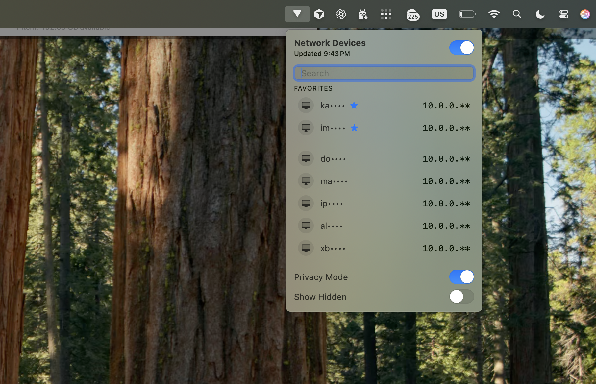

# Pinglet

A lightweight macOS menu bar app that lists devices on the local network by name and IP.
Small menu bar, big visibility.

**Highlights**
- Auto-refresh on a timer and when Wi-Fi connects/changes
- Favorites pinned to the top
- Privacy Mode (mask names + IP last octet)
- Hidden devices with a “Show Hidden” toggle
- Right-click context menu actions
- Search filter

## Run

Open `Package.swift` in Xcode and run the `Pinglet` scheme (macOS 13+).

## How It Works

- The app refreshes the ARP cache automatically and periodically sweeps the subnet in the background to keep the list fresh.
- Wi-Fi connect/change events trigger an immediate refresh.
- Devices without a resolvable name are hidden.

## Notes

- Scanning is intentionally capped at 512 hosts to avoid long sweeps on large networks.
- Device names come from reverse DNS/ARP. Entries without a name are hidden.

## Controls

- **Left click** runs your selected default action.
- **Right click** opens a context menu with:
- Open in Terminal
- Copy IP
- Run Command…
- Copy SSH Command
- Favorite / Unfavorite
- Hide / Unhide
- Left Click submenu (sets the default action)

## Settings

- **Privacy Mode** masks device names and IPs.
- **Show Hidden** reveals devices you hid.

## Release Builds (GitHub Actions)

This repo includes a release workflow that builds a macOS `.app` and attaches it to a GitHub Release when you push a tag.

### Create a release

1. `git tag v1.0.0`
2. `git push origin v1.0.0`

The workflow will build and upload `Pinglet-<version>-macOS.zip`.

### Notes on signing

The release artifact is unsigned. If you want notarized releases later, we can add codesigning + notarization steps.
